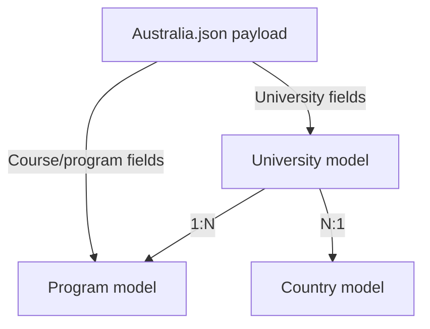

# Australia.json — Data Analysis & Normalization Plan

## Overview

| Metric | Value |
|--------|-------|
| **Total records (courses)** | 517 |
| **Unique universities** | 35 (+ 22 records with `null` university) |
| **Unique fields per payload** | ~90 |
| **File size** | 3.7 MB |
| **Structure** | `{ "data": [...], "search-id": 14241657 }` |

> [!IMPORTANT]
> Each record is a **course/program**, NOT a university. University data is **denormalized** — repeated across every course belonging to that university.

---

## Data Architecture: JSON → Prisma Schema Mapping

The scraped data maps to **two Prisma models**:

---

## Field-by-Field Analysis

### 🏫 University-Level Fields (extracted once per unique university)

These fields are **duplicated across every course** for the same university and need to be **deduplicated** into a single `University` row.

| JSON Field | Prisma Field | Type | Filled | Null | Issues |
|------------|-------------|------|--------|------|--------|
| `UniversityId` | `sourceId` | Int | 495 | 22 | **22 records have null UniversityId** ⚠️ |
| `universityName` | `name` | String | 495 | 22 | 22 null |
| `universityCity` | `city` | String | 466 | 51 | 51 null — needs fallback |
| `universityState` | — | String | 480 | 37 | Not in schema, useful metadata |
| `universityCountry` | → `countryId` | String | 494 | 23 | Always "Australia" when present |
| `USNewsRanking` | `usNewsRanking` | Int | 27 | 513 | Very sparse (5%) |
| `QSRanking` | `qsRanking` | Int | 442 | 517 | Good coverage (85%) |
| `WebomatricsNationalRanking` | `webomatricsNationalRanking` | Int | 455 | 85 | Good coverage (88%) |
| `WebomatricsWorldRanking` | `webomatricsWorldRanking` | Int | 455 | 85 | Good coverage (88%) |
| `universityLogoExtension` | `universityLogoExtension` | String | 494 | 23 | Always `.jpeg` |
| `universityAverageScholarship` | `universityAverageScholarship` | Decimal | 0 | 517 | **100% null** ❌ |
| `universityAverageScholarshipRemarks` | `universityAverageScholarshipRemarks` | String | 0 | 517 | **100% null** ❌ |

### 📚 Program/Course-Level Fields (one row per record)

#### Identity & Classification

| JSON Field | Prisma Field | Type | Filled | Null | Issues |
|------------|-------------|------|--------|------|--------|
| `Id` | `sourceId` | Int | 495 | 22 | 22 null — **need synthetic IDs** |
| `Name` | `name` | String | 495 | 22 | |
| `Concentration` | `concentration` | String | 3 | 514 | Very sparse |
| `StudyLevelId` | `studyLevelId` | Int | 494 | 23 | |
| `Studylvl` | `studyLevel` | String | 494 | 23 | Values: Undergraduate, Postgraduate, Pathway Programs, etc. |
| `CategoryId` | `categoryId` | String | 493 | 23 | **Multi-value strings** like `"4,16"`, `"6, 3"` ⚠️ |
| `SubCategoryId` | `subCategoryId` | String | 493 | 23 | |
| `IsStemCourse` | `isStemCourse` | Bool | 468 | 49 | |
| `IsOnlineCourse` | `isOnlineCourse` | Bool | 468 | 49 | |
| `IsExtraChoicesOfPrograms` | `isExtraChoicesOfPrograms` | Bool | 468 | 49 | |
| `Highlights` | `highlights` | String | 89 | 428 | |
| `UniversityOrder` | `universityOrder` | Int | 494 | 23 | |

#### Duration & Location

| JSON Field | Prisma Field | Type | Filled | Null | Issues |
|------------|-------------|------|--------|------|--------|
| `Duration` | `durationMonths` | Int | 494 | 23 | Value in **months** |
| `Campus` | `campus` | String | 493 | 24 | **Contains `\n` prefixes** in 6 records ⚠️ |
| `CountryId` | `countryId` | Int | 494 | 23 | Numeric source country ID |
| `CohortCountryCode` | `cohortCountryCode` | String | 493 | 24 | Always "AU" |

#### Fees & Financial

| JSON Field | Prisma Field | Type | Filled | Null | Issues |
|------------|-------------|------|--------|------|--------|
| `Amount` | `amount` | Decimal | **493** | 24 | String like `"29072.00"` — needs parsing |
| `TutionFee` | `tuitionFeeText` | String | 381 | 136 | Raw text like `"AUD 31246/Yer"` (typo!) |
| `CurrencyCode` | `currencyCode` | String | 494 | 23 | Always `"AUD"` |
| `Currency` | `currency` | String | 494 | 23 | Always `"AU$"` |
| `TuitionFeeCurrency` | `tuitionFeeCurrency` | String | 493 | 24 | |
| `ApplicationFee` | `applicationFee` | String | 83 | 434 | |
| `ApplicationFeeAmt` | `applicationFeeAmt` | Decimal | 468 | 49 | String `"0"` mostly |
| `ApplicationFeeCurrency` | `applicationFeeCurrency` | String | 493 | 24 | |
| `AppFeeWaiverAvailable` | `appFeeWaiverAvailable` | Bool | 468 | 49 | |
| `DepositCurrency` | `depositCurrency` | String | 0 | 517 | **100% null** |
| `DepositSortAmount` | `depositSortAmount` | Decimal | 493 | 24 | |
| `CourseDeposit` | `courseDeposit` | JSON | 493 | 24 | Nested object with deposit details |
| `UniversityDeposit` | `universityDeposit` | JSON | 493 | 24 | Usually `{}` |
| `CommissionAmount` | `commissionAmount` | Decimal | 410 | 107 | |
| `CommissionMode` | `commissionMode` | String | 410 | 107 | |
| `CommissionCurrency` | `commissionCurrency` | String | 410 | 107 | |
| `commissionToolTipMessage` | `commissionToolTipMessage` | String | 0 | 517 | **100% null** |
| `IncreasedCommissions` | `increasedCommissions` | JSON | 468 | 49 | Usually `[]` |

#### Intakes & Deadlines

| JSON Field | Prisma Field | Type | Filled | Null | Issues |
|------------|-------------|------|--------|------|--------|
| `Intakes` | `intakes` (parsed) | String | 485 | 32 | Comma-separated: `"Sep, Feb, May"` |
| `DisplayIntakes` | `displayIntakes` | String[] | 485 | 32 | Already array: `["Feb","May","Sep"]` |
| `ApplicationDeadline` | `applicationDeadline` | String | 0 | 517 | **100% null** |
| `ApplicationDeadlineDetails` | `applicationDeadlineDetails` | String | 0 | 517 | **100% null** |
| `IntakesAndDeadlines` | `intakesAndDeadlines` | String | 0 | 517 | **100% null** |
| `UpcomingIntakeDeadLines` | `upcomingIntakeDeadLines` | String | 88 | 429 | 405 empty strings |
| `IntakesClosed` | `intakesClosed` | String | 416 | 101 | Complex format: `"Feb:::2026:::0:::1:::Intake Passed"` |
| `ApplicationMode` | `applicationMode` | String | 0 | 517 | **100% empty** |
| `ApplicationCount12Mo` | `applicationCount12Mo` | Int | 397 | 120 | |

#### Test Scores & English Requirements

| JSON Field | Prisma Field | Type | Filled | Null | Issues |
|------------|-------------|------|--------|------|--------|
| `IeltsOverall` | `ieltsOverall` | Float | 454 | 63 | |
| `IeltsNoBandLessThan` | `ieltsNoBandLessThan` | Float | 454 | 63 | |
| `IeltsRequired` | `ieltsRequired` | Bool | 451 | 66 | |
| `PteScore` | `pteScore` | Int | 446 | 71 | |
| `PteNoSectionLessThan` | `pteNoSectionLessThan` | Int | 446 | 71 | |
| `PteRequired` | `pteRequired` | Bool | 451 | 66 | |
| `ToeflScore` | `toeflScore` | Int | 7 | 510 | Very sparse |
| `ToeflNoSectionLessThan` | `toeflNoSectionLessThan` | Int | 6 | 511 | Very sparse |
| `ToeflRequired` | `toeflRequired` | Bool | 451 | 66 | |
| `DETScore` | `detScore` | Int | 0 | 517 | **100% null** |
| `DETRequired` | `detRequired` | Bool | 419 | 98 | |
| `GreScore` | `greScore` | Int | 0 | 517 | **100% null** |
| `GreRequired` | `greRequired` | Bool | 419 | 98 | |
| `GmatScore` | `gmatScore` | Int | 0 | 517 | **100% null** |
| `GmatRequired` | `gmatRequired` | Bool | 419 | 98 | |
| `SatScore` | `satScore` | Int | 0 | 517 | **100% null** |
| `SatRequired` | `satRequired` | Bool | 419 | 98 | |
| `ActScore` | `actScore` | Int | 0 | 517 | **100% null** |
| `ActRequired` | `actRequired` | Bool | 419 | 98 | |
| `WithoutEnglishProficiency` | `withoutEnglishProficiency` | Bool | 463 | 54 | |
| `EnglishMarks12Score` | `englishMarks12Score` | Float | 0 | 517 | **100% null** |
| `IsMOIWaiver` | `isMOIWaiver` | Bool | 439 | 78 | |
| `IELTSWaiverScoreCBSE` | `ieltsWaiverScoreCBSE` | Float | 1 | 516 | |
| `IELTSWaiverScoreState` | `ieltsWaiverScoreState` | Float | 1 | 516 | |
| `ElpAvailable` | `elpAvailable` | Bool | 0 | 517 | **100% null** |
| `EslAvailable` | `eslAvailable` | Bool | 0 | 517 | **100% null** |
| `ESLELPDetail` | `eslElpDetail` | String | 0 | 517 | **100% null** |

#### Entry Requirements

| JSON Field | Prisma Field | Type | Filled | Null | Issues |
|------------|-------------|------|--------|------|--------|
| `EntryRequirement` | `entryRequirement` | String | 427 | 90 | Free text |
| `EntryRequirementTwelfth` | `entryRequirementTwelfth` | String | 414 | 103 | |
| `EntryRequirementTwelfthOutOf100` | `entryRequirementTwelfthOutOf100` | String | 414 | 103 | |
| `EntryRequirementTwelfthOutOf45` | ... | String | 414 | 103 | |
| `EntryRequirementTwelfthOutOf10` | ... | String | 414 | 103 | |
| `EntryRequirementTwelfthOutOf7` | ... | String | 414 | 103 | |
| `EntryRequirementTwelfthOutOf5` | ... | String | 414 | 103 | |
| `EntryRequirementTwelfthOutOf4` | ... | String | 414 | 103 | |
| `EntryRequirementUG` | `entryRequirementUG` | String | 60 | 457 | |
| `EntryRequirementUgOutOf100` | ... | String | 60 | 457 | |
| (+ other UG scales) | ... | ... | ... | ... | Same pattern |
| `WithoutMaths` | `withoutMaths` | Bool | 464 | 53 | |
| `WorkExp` | `workExp` | String | 225 | 292 | String `"0.00"` — years? |
| `backlog` | `backlog` | Int | 197 | 320 | |
| `BacklogRange` | `backlogRange` | String | 197 | 320 | |
| `FifteenYearsEducation` | `fifteenYearsEducation` | Bool | 419 | 98 | |

#### Scholarship & Internship

| JSON Field | Prisma Field | Type | Filled | Null | Issues |
|------------|-------------|------|--------|------|--------|
| `ScholarshipAvailable` | `scholarshipAvailable` | Bool | 219 | 298 | |
| `ScholarshipDeatil` | `scholarshipDetail` | String | 36 | 481 | Note: source has typo "Deatil" |
| `InternshipAvailable` | `internshipAvailable` | Bool | 0 | 517 | **100% null** |
| `AverageScholarship` | `averageScholarship` | Decimal | 242 | 275 | String `"9000.00"` |
| `AverageScholarshipRemarks` | `averageScholarshipRemarks` | String | 242 | 275 | |

#### Eligibility Arrays

| JSON Field | Prisma Field | Type | Filled | Null | Issues |
|------------|-------------|------|--------|------|--------|
| `EligibleCountryIds` | `eligibleCountryIds` | Int[] | 468 | 49 | Array of int IDs |
| `EligibleCountryIdStudyLevelIds` | `eligibleCountryIdStudyLevelIds` | String[] | 468 | 49 | Array of `"countryId|levelId"` |
| `EligibleStateIds` | `eligibleStateIds` | Int[] | 0 | 517 | **100% null** — store as `[]` |

---

## 🚨 Data Quality Issues Found

### Critical

| # | Issue | Records | Action |
|---|-------|---------|--------|
| 1 | **22 records with null `UniversityId`** | 22 | Skip or assign synthetic IDs |
| 2 | **29 potential duplicate** course+university combos | 29 | Deduplicate by `Id` (sourceId) |
| 3 | **`CategoryId` is multi-value** (e.g. `"4,16"`, `"6, 3"`) | ~60 | Store as-is in `categoryId` string field |

### Cleaning Required

| # | Issue | Records | Action |
|---|-------|---------|--------|
| 4 | `Campus` has `\n` prefix characters | 6 | `.trim()` whitespace |
| 5 | `TutionFee` has typo "Yer" instead of "Year" | many | Store raw, don't parse |
| 6 | `Amount` is string `"29072.00"` | 493 | `parseFloat()` → Decimal |
| 7 | `ApplicationFeeAmt` is string `"0"` | 468 | `parseFloat()` → Decimal |
| 8 | `DepositSortAmount` is string | 493 | `parseFloat()` → Decimal |
| 9 | `WorkExp` is string `"0.00"` | 225 | Store as-is (schema is String) |
| 10 | `Intakes` is comma-separated string | 485 | Split into array |

### Fields That Are 100% Null (can be omitted)

These fields exist in every payload but contain **zero data** for Australia:

- `ApplicationDeadline`, `ApplicationDeadlineDetails`, `IntakesAndDeadlines`
- `DETScore`, `GreScore`, `GmatScore`, `SatScore`, `ActScore`
- `EnglishMarks12Score`, `ElpAvailable`, `EslAvailable`, `ESLELPDetail`
- `universityAverageScholarship`, `universityAverageScholarshipRemarks`
- `DepositCurrency`, `InternshipAvailable`, `commissionToolTipMessage`

> [!NOTE]
> These null fields still get stored as `null` in the database — no data loss. They may have values in other country JSONs (Canada, UK, etc.).

---

## 📊 Data Distribution Summary

### Study Levels
| Level | Count |
|-------|-------|
| Undergraduate | 193 |
| Pathway Programs (UG) | 153 |
| Postgraduate | 98 |
| UG Diploma/Certificate | 24 |
| Pathway Programs (PG) | 23 |
| Other/null | 26 |

### Top Universities (by course count)
| University | Courses |
|------------|---------|
| University of Notre Dame | 86 |
| Curtin College | 56 |
| Southern Cross University, Gold Coast | 39 |
| Southern Cross University, Sydney | 22 |
| Deakin College | 20 |
| James Cook University, Brisbane | 19 |

### Ranking Coverage
| Ranking | Coverage |
|---------|----------|
| QS Ranking | 85% (442/517) |
| Webomatrics National | 88% (455/517) |
| Webomatrics World | 88% (455/517) |
| US News Ranking | **5%** (27/517) — very sparse |

### Intake Months
| Month | Courses |
|-------|---------|
| Feb | 244 |
| Mar | 195 |
| Jun | 195 |
| Oct | 172 |
| Jul | 147 |

---

## ✅ Schema Compatibility Check

The Prisma schema's `University` + `Program` models **already match this data structure well**. The schema was clearly designed with this JSON format in mind.

> [!TIP]
> The `sourceId` field on both `University` and `Program` models exists specifically for deduplication during import — use `UniversityId` → `University.sourceId` and `Id` → `Program.sourceId` with upsert operations.

---

## Next Steps — Your Decision

How would you like to proceed?

1. **Build the import/seed script** — Write a Node.js script that reads `Australia.json`, deduplicates universities, cleans the data, and upserts into `University` + `Program` tables via Prisma
2. **Analyze other country files first** — Run the same analysis on `Canada.json` (33 MB!), `UnitedKingdom.json` (14 MB), etc. to see if they share the same field structure
3. **Schema adjustments** — Add any missing fields (e.g. `universityState`) before importing
4. **Skip the 22 null-university records** vs. create placeholder universities for them
